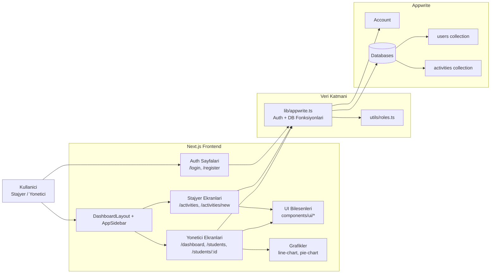
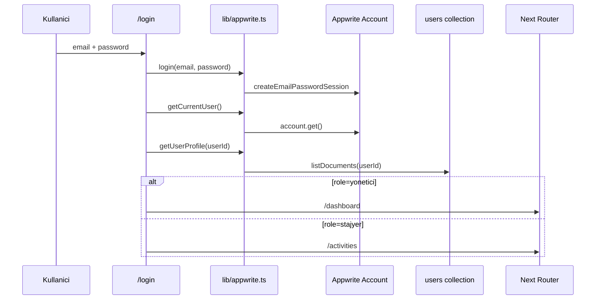

# Mimari Harita (Parcalara Ayrilmis)

Bu dokuman, projeyi tek karmasik graf yerine is alanlarina boler.

## 1) Sistem Gorunumu



## 2) Auth ve Yonlendirme Akisi



## 3) Stajyer Aktivite Akisi

```mermaid
flowchart LR
    A[Stajyer] --> B[/activities/new Form]
    B --> C[Validation\nzod + react-hook-form]
    C --> D[createActivity]
    D --> E[lib/appwrite.ts]
    E --> F[(activities collection)]
    F --> G[/activities listesi]
    G --> H[getActivityByUser]
    H --> E
```

## 4) Yonetici Izleme ve Geri Bildirim

```mermaid
flowchart LR
    M[Yonetici] --> D[/dashboard]
    M --> S[/students]
    S --> SD[/students/:id]

    D --> API1[getTotalInterns/getTotalActivities/...]
    SD --> API2[getActivityByUser + updateActivity]
    API1 --> APP[lib/appwrite.ts]
    API2 --> APP
    APP --> USERS[(users)]
    APP --> ACT[(activities)]
    SD --> CH[LineChart + PieChart]
```

## 5) Klasor Bazli Sorumluluk

- `app/`: route ve sayfa seviyesinde akislari kurar
- `components/`: ekran ve ortak UI bilesenleri
- `lib/appwrite.ts`: tum Appwrite auth + database cagri merkezi
- `hooks/`: ekran yardimci hooklar
- `utils/`: rol gibi kucuk saf yardimci mantiklar

## 6) Eraser.io icin Kullanim

- Bu dosyadaki her Mermaid blogunu ayri canvas olarak acin.
- Her canvas'i su isimlerle tutun:
- `01-system-overview`
- `02-auth-flow`
- `03-intern-activity-flow`
- `04-manager-analytics-flow`
- Tek devasa grafik yerine 4 kucuk grafik kullanin; okunabilirlik ciddi artar.
